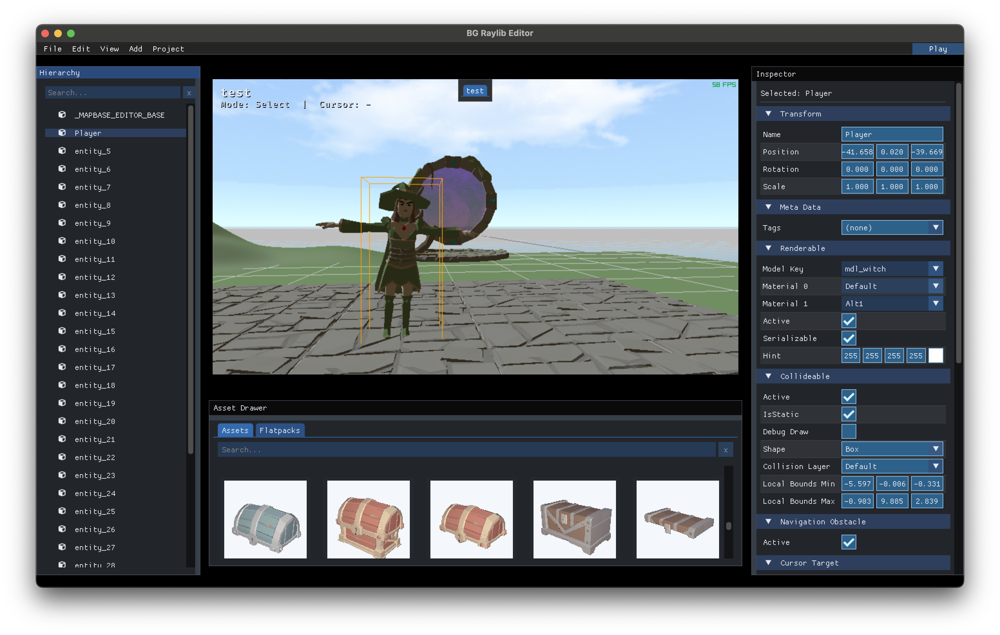
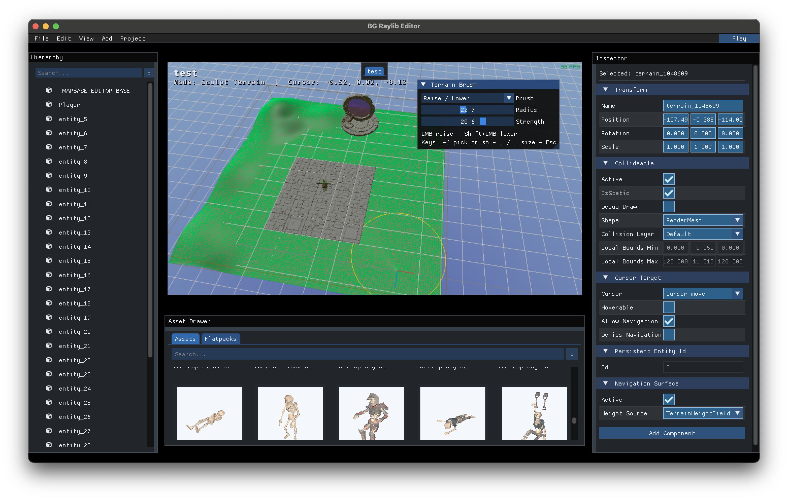

# SAGE (Steve's Awesome Game Engine)

[Click here for a video demonstration](https://www.youtube.com/watch?v=yNF9LtaBrrs)

SAGE is a C++20 game engine and editor layer built on top of raylib and EnTT. It provides the reusable runtime,
tooling, rendering, scripting, serialization, and editor systems needed to build 3D games.

## Screenshots




## Core Features

- Integrated editor for building maps, placing entities, editing components, and testing changes in play mode.
- Terrain tools for sculpting heightfields, authoring navigation surfaces, and aligning gameplay objects to the world.
- Navigation and movement systems designed for point-and-click controls, including multi-tile footprints, obstacle
  avoidance, and smooth actor turning.
- Collision and trigger system with raycasts, box/mesh queries, collision layers, and an editable collision matrix.
- Rendering stack for dynamic models, skinned animation, emissive materials, skyboxes, custom shaders, and particles.
- Typed C# scripting for entity behaviours, gameplay events, and project-specific game APIs.
- Custom UI framework for in-game windows, tables, tooltips, drag-and-drop, and themed HUD overlays.
- Editor undo/redo history, including hierarchy edits, component changes, transforms, terrain sculpting,
  and multi-selection edits.
- Packed asset and serialization pipeline for loading game resources, saving editor maps, and reusing groups of entities
  as flatpacks.

## Code Examples

- [Component registration](engine/ComponentRegistration.hpp) uses one declaration to expose components to scripting,
  editor inspectors, and persistence without coupling the runtime to game-specific types.
- [Navigation grid system](engine/systems/NavigationGridSystem.cpp) implements grid construction, occupancy, and route
  finding for actors with different footprints.
- [Collision system](engine/systems/CollisionSystem.cpp) handles collision queries and interaction between registered
  collision layers.
- [Custom UI engine](engine/ui/GameUIEngine.cpp) drives retained game UI, layout, input, and rendering.
- [C# scripting bridge](engine/systems/CSharpScriptSystem.cpp) connects managed behaviours to entities and native engine
  services.
- [Editor history](editor/EditorHistory.cpp) provides undo and redo for editor operations.

## Flatpacks

Flatpacks are reusable, prefab-like entity hierarchies. A flatpack stores a root entity and its transform subtree,
including supported engine components, registered game-specific components, scripts, animations, and internal entity
references. Each instance receives fresh entities and can be positioned or rotated as a group when it is added to a
scene.

The editor presents flatpacks in an asset catalog with generated thumbnails and supports isolated editing without
discarding the current map session. At runtime, C++ and C# code can instantiate a flatpack by name, making the same
authored object available to editor workflows and procedural gameplay.

## Dependencies

C++20, CMake, .NET 10, raylib, EnTT, cereal, ImGui, and magic_enum.

## C# component APIs

Script-facing component data stays beside the C++ component in a language-neutral
`define_script_api` declaration:

```cpp
template <class Api>
static void define_script_api(Api& api)
{
    api.property("Active", &Collideable::active);
    api.readonly("ClipCount", &Animation::animsCount);
    api.method(
        "Play",
        static_cast<bool (Animation::*)(std::string_view)>(&Animation::ChangeAnimationByName),
        {"clip"});
}
```

Register the component once with `ScriptApiRegistry::RegisterComponent`. The native
runtime consumes the declaration for safe entity/component dispatch, and the CMake
build generates the matching typed C# wrapper under `managed/**/Generated/`.

Properties and methods currently support booleans, signed and unsigned integers,
floats, strings, `Vector3`, entity handles, and registered enums. Computed properties
can provide getter/setter lambdas when direct member access would bypass a system
invariant, as the transform bindings do.

Generated wrappers are retrieved through the generic component API. Scripts can
query their own entity directly, or use the same method on another entity handle:

```csharp
if (GetComponent<Collideable>() is { } collideable)
    collideable.Active = false;

var movement = other.GetComponent<MoveableActor>();
```

Attached C# scripts are retrieved separately because they are managed reference
types rather than generated component wrappers:

```csharp
if (other.GetScript<DoorController>() is { } door)
    door.Open();
```

`GetScript<T>()` returns the live script instance for that entity and Play session,
or `null` when the entity does not have a script of that type.
